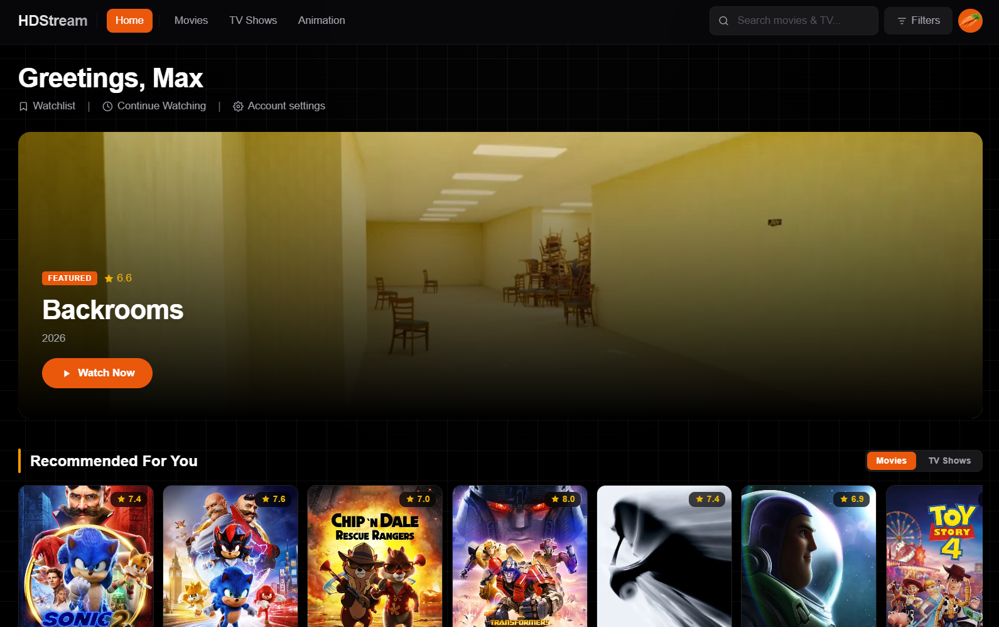
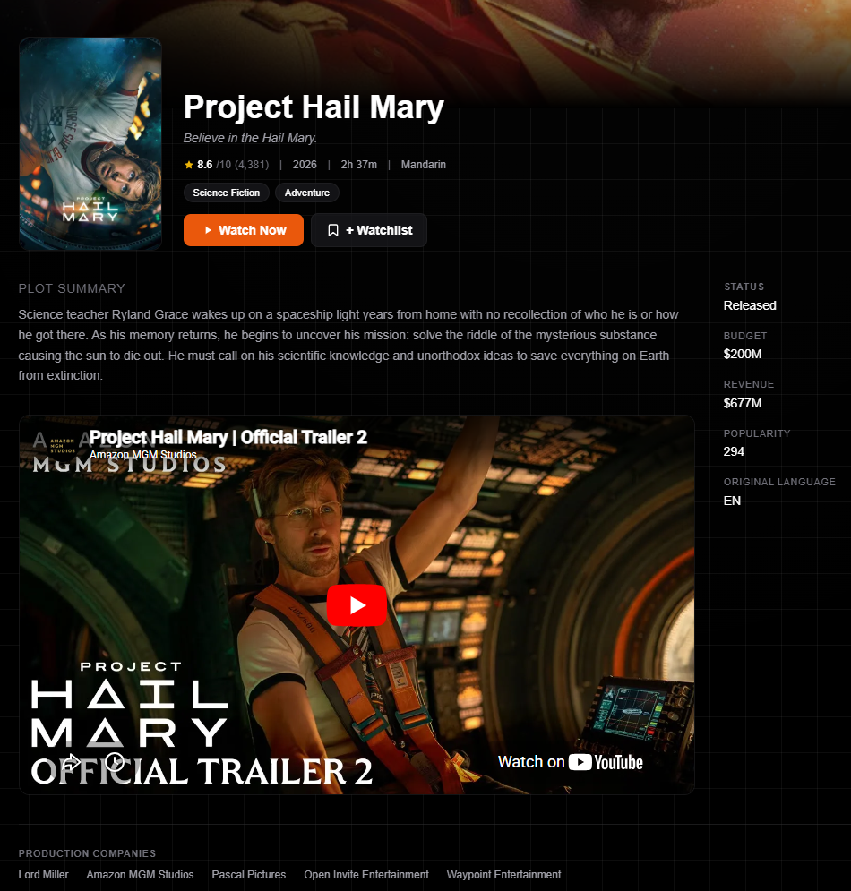
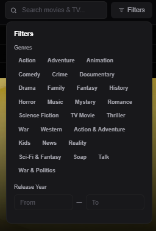
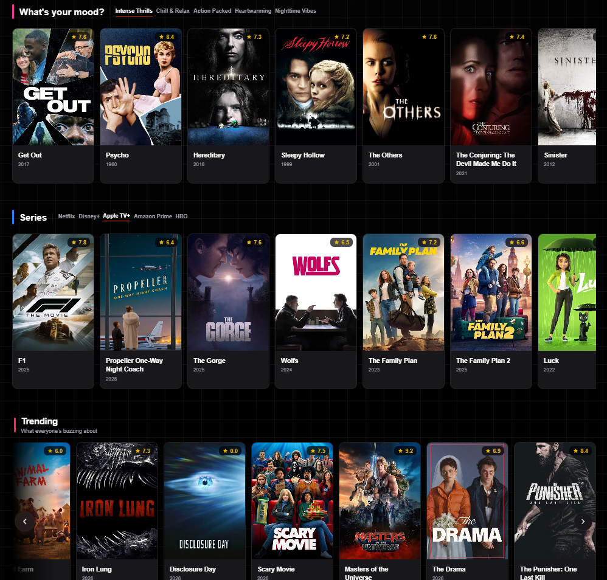
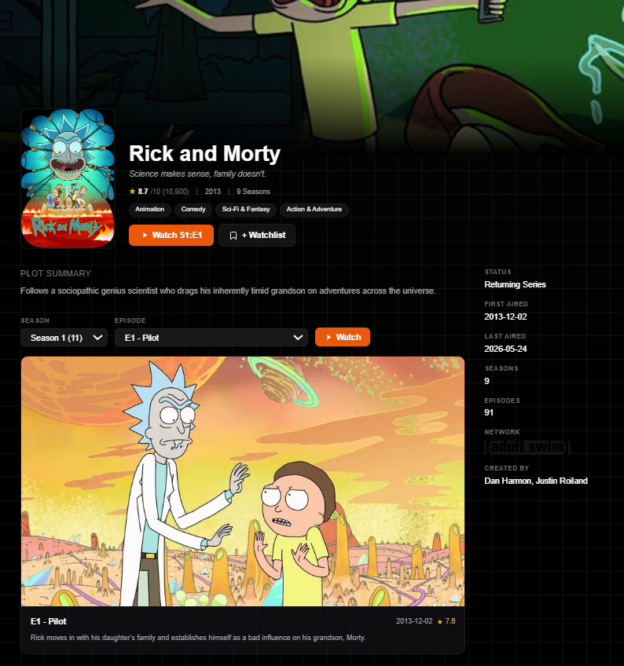
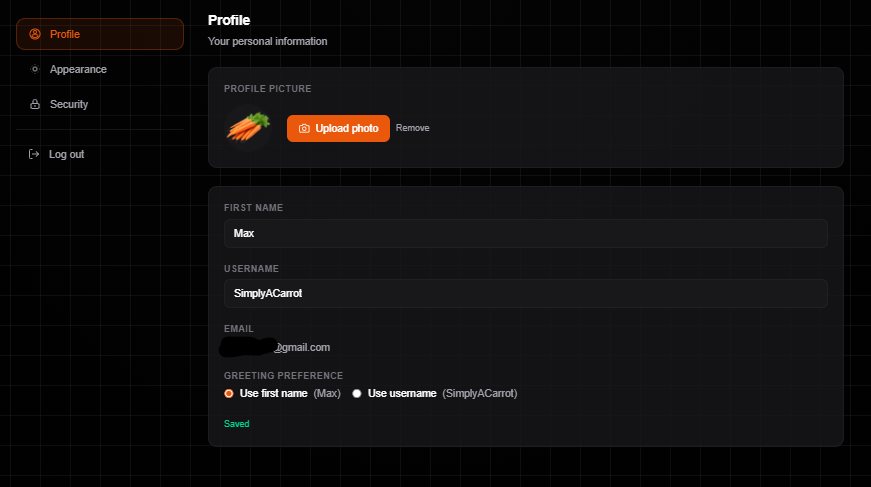
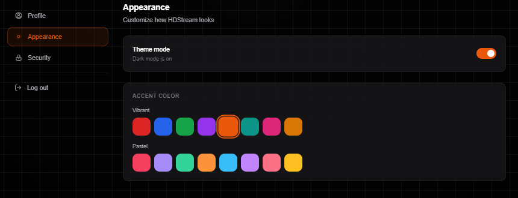
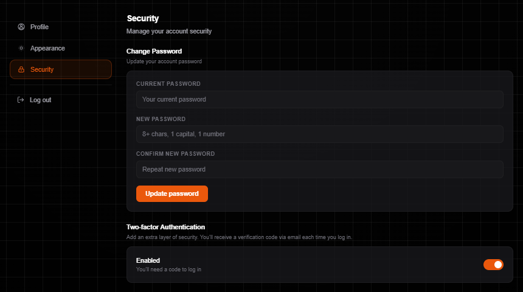
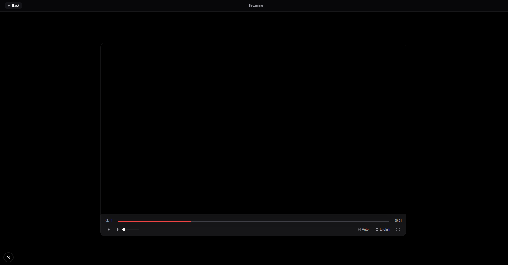

# HDStream

HDStream is a streaming web app I made to learn modern frontend and full stack web development. Before this project, I had very little experience with React, Next.js, TypeScript, or frontend design. The goal of HDStream was not to create a production streaming service, but to gain experience designing UIs, working with multiple APIs, creating recommendation algorithms, and learning how modern web apps are structured.

Throughout this project, I designed the whole UI, implemented many features, and perfected the platform while learning all of the technologies behind it.

> This repository is intended for educational and portfolio purposes. No copyrighted media or streaming providers are included in this repository.

## Key Achievements

- Built a full stack streaming platform using Next.js and TypeScript
- Write around 6,400 lines of code across the frontend and backend systems
- Implemented an account registering system, login, password reset, email verification, Google OAuth, and 2FA
- Created a recommendation algorithm based on watch history, watchlists, most watched genres, and TMDB recommendation data
- Developed a continue watching system that syncs viewing progress between sessions
- Designed a customisable UI with high theme customizability, incluidng multiple accent colors and dark/light mode support
- Integrated TMDB APIs for movie, TV show, genre, and recommendation data
- Implemented watchlists, profiles, avatar uploads, onboarding, and account management systems
- Learned how modern web apps are structured, how frontend and backend systems work with eachother, and how to integrate authentication, databases, APIs, and features into a single platform

### Project Statistics

- Total code written: ~6,400 lines
- Frontend files: 14
- Backend API routes: 27
- Database: SQLite
- Authentication methods: Email/Password + Google OAuth
- Theme options: 14 accent colors + 2 themes
- Recommendation sources: Watch history, watchlists, genres, TMDB recommendations
- Supported content types: Movies and TV Shows

### Technical Architecture

The application contains multiple systems:

- Next.js frontend
- TypeScript backend API routes
- SQLite database
- JWT authentication
- Google OAuth integration
- SMTP email services
- TMDB API integration
- Watch progress tracking
- Recommendation engine

All of these systems work together for authentication, personalization, tracking watch data, accounts, profiles, and content discovery features.

### My Role

As the only developer, I was responsible for:

- Frontend design and development
- Backend API development
- Authentication systems
- Database integration
- Recommendation algorithm design
- Theme system implementation
- User experience design
- Feature planning and testing

### Challenges

#### Authentication & Security

Implementing secure authentication required me to work with password hashing, JWT session handling, email verification, password resets, Google OAuth, and 2FA flows. While AI assisted heavily with the implementation of these systems, I spent time understanding how the different systems worked with eachother and how common security features are structured in other web apps. At the end of the project, I was comfortable modifying and extending these systems, debugging authentication issues, and guiding AI-generated code toward the exact functionality I wanted, even though I would not yet consider myself fully proficient in building every component entirely from scratch.

#### Recommendation Systems

Creating recommendations that felt relevant required experimenting with watch history weight, most watched genres, watchlists, recently watched content, and TMDB recommendation data. During the development period of creating the recommendation algorithm, alot of the same movies would often show up in multiple sections, such as trending, for you, and popular. Due to certain movies and TV shows being boosted in the TMDB algorithm, my algorithm would be affected, causing me to experiment with some bootleg fixes to get the algorithm random enough to not look repeditive, but also look like it was chosen for you.

### Lessons Learned

Developing HDStream taught me:

- React and frontend development
- Next.js app architecture
- TypeScript fundamentals
- Authentication and authorization
- API design and integration
- Database design and data management
- Recommendation system design
- UI design
- Working with AI-assisted development workflows

### Screenshots

#### Home Page

#### Movie Details

#### Search / Filters / Genres

#### TV Shows

#### Continue Watching

#### Settings

##### Profile

##### Themes

##### Security

#### Media Player

> Obfuscated movie for copyright purposes

